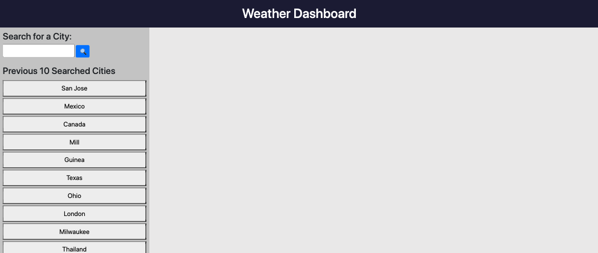

# 06 Server-Side APIs: Weather Dashboard

* Functioning Website link: https://jxiong15.github.io/06-weather/
    * Displays an interactive weather dashboard.
* GitHub Repository Link: https://github.com/JXIong15/06-weather

## Functionalitty

* When the page is loaded, the main dash is empty. The left hand column should display up to the past 10 searched city (if there are any).
* When the user searches a city, they are presented with the current weather information in the large dash. In the dash below, the user is presented with the 5-day forecast for that city.
    * A button is created for the search city, which is prepended to the left column
* When a button on the left column is clicked, the weather dash for that city button is displayed.

## Tasks Completed

* Created IDs in the HTML file to reference via JQuery in the JS file.
* Created CSS styling using flexbox
* In the JS file, the left column calls on localStorage to display all the buttons of the past 10 searched cities before the user starts a new search.
* In the JS file, created a button function that will search a user-specified city
    * The button function then calls on another function, which uses APIs to get the weather information on that desired city.
        * Used an API to get the current weather data for the desired city.
        * Used an API to get the 5 day forecast for the desired city.
        * Used an API to calculate the UV Index for the desired city.
            * Created a function to color-code the UV Index accordingly.
        * Used an API to append the weather icon to the correct weather card.
    * If the APIs do not work, an alert indicating what the problem is will pop up.
    * Another button is created in the left-hand column for the searched city, which is stored in localStorage.
        * When this button is clicked, then the city of the button name is searched using the function to display on the weather dash.
        * Used an array of up to length 10 to make sure no repeat buttons are made
            * Formatted input values to be the same regardless of capitalization

## Known Bugs

* Is not flexing on smaller screens. Instead of the original 2 columns, there should be one.

## Website Images

* Empty Dash: 

* New Search: 

* Unsafe UV Index: 

* Safe UV Index: 

## Sources

* Used APIs from https://openweathermap.org/api
    * Current Weather: https://openweathermap.org/current
    * 5-Day Forecast: https://openweathermap.org/forecast5
    * UV Index: https://openweathermap.org/api/uvi
    * Weather Icons: http://openweathermap.org/img/wn/10d@2x.png

- - -
© 2021 Jou Xiong, Northwestern Coding Bootcamp